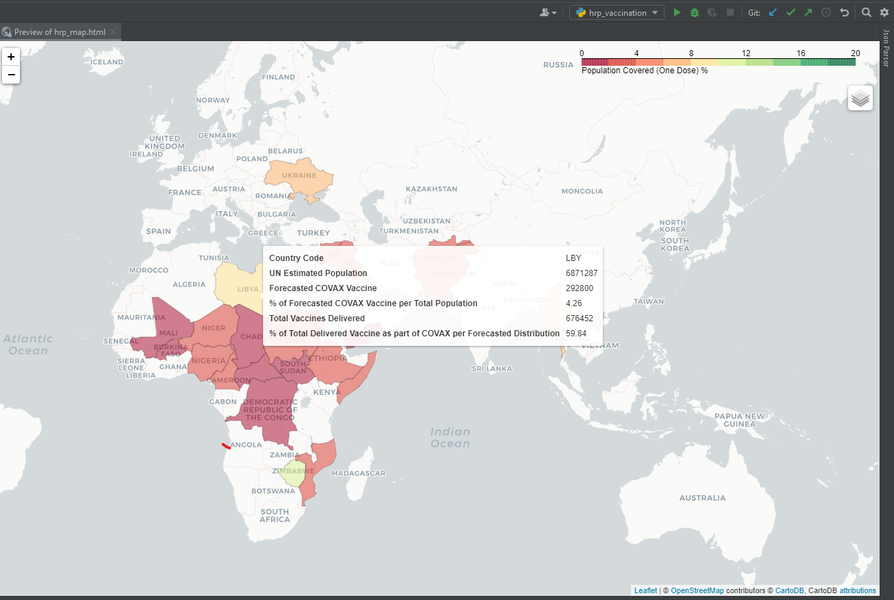

# vaccination_in_hrp_countries

A visualization of vaccination rollout data of populations in need of humanitarian assistance and protection residing in countries with country-specific humanitarian response plans.

## Introduction

As of 2021, over 235 million people need humanitarian assistance and protection. In March 2020, the UN launched the [Global Response Plan for Covid-19](https://reliefweb.int/report/world/global-humanitarian-response-plan-covid-19-april-december-2020-ghrp-july-update-enar) in order to respond to three strategic priorities:

- Contain the spread of the virus and decrease morbidity and mortality. 
- Decrease the deterioration of human assets and rights, social cohesion, food security and livelihoods. 
- Protect, assist and advocate for refugees, IDPs, migrants and host communities particularly vulnerable to the virus.

In the scope of Global Humanitarian Overview 2021, the following countries have country-specific humanitarian response plans (HRP). 
Further on in these countries will be named as HRP countries:

    Afghanistan, Burundi, Burkina Faso, Cameroon, Central African Republic, Chad, Colombia, Democratic Republic of the Congo (DRC), Ethiopia, Haiti, Iraq, Libya, 
    Mali, Myanmar, Mozambique, Niger, Nigeria, occupied Palestinian territories, Pakistan, Somalia, South Sudan, Sudan, Syria, Ukraine, Venezuela, Yemen, Zimbabwe

[COVAX](https://www.gavi.org/covax-facility) has allocated 73M doses of vaccines to HRP countries in its first round. Unlike the forecasted doses, vaccines are being delivered to HRP countries remain  small quantities. Also, vaccine administration rates remain low in HRP countries.

## Purpose

Lower administration of vaccines remains a challenge in HRP countries. As of 31 March, for every 165 people globally receiving a dose of COVID-19 vaccine only one person resided in a country with a Humanitarian Response Plan.

This application creates a visualisation of HRP countries' vaccine situations based on the dataset published on [the Humanitarian Data Exchange](https://data.humdata.org/dataset/covid-19-vaccine-doses-in-hrp-countries).

# Installation

- Install miniconda
- Create a conda environment
- Install `pndas, geopandas` and `folium`

# Run

- Run `main.py`
- The visualization will be saved to `./out/hrp_map.html`. Open the file in your browser to navigate the data on the world map.

# References
- [Visualising Geospatial data with Python using Folium](https://www.kdnuggets.com/2018/09/visualising-geospatial-data-python-folium.html)
- [Interactive Maps using Folium](https://coderzcolumn.com/tutorials/data-science/interactive-maps-choropleth-scattermap-using-folium#3.2) 
- [A Complete Guide to an Interactive Geographical Map using Python](https://towardsdatascience.com/a-complete-guide-to-an-interactive-geographical-map-using-python-f4c5197e23e0)
- [COVID-19 Impact on Humanitarian Emergencies: March 2021 Highlights](https://interagencystandingcommittee.org/health/covid-19-impact-humanitarian-emergencies-march-2021-highlights)